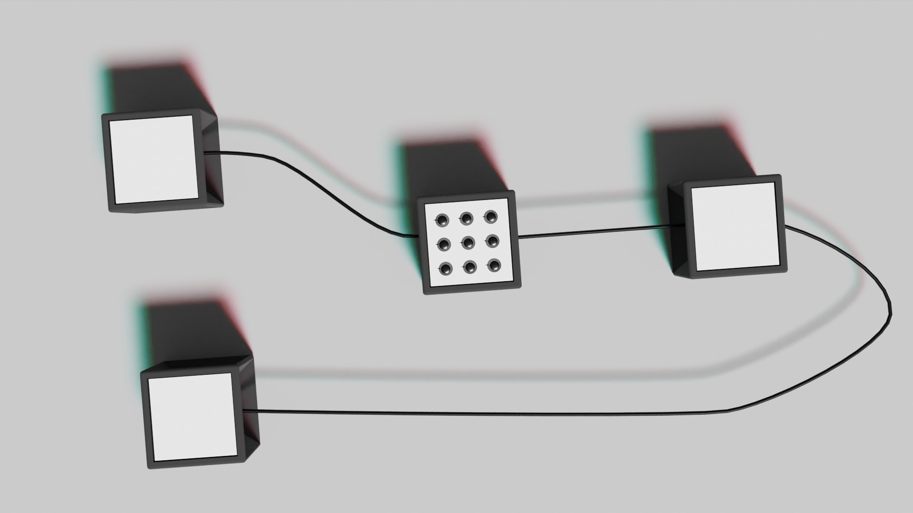

# AetherElements
## Modular Radionic Elements

The reason for this new radionics software project is to provide a stronger architecture foundation, 
to avoid to rewrite common elements, to facilitate the development of new ideas and software for radionics, or to
embed radionics into pre-existing software.

## Build
Just use maven on the root directory, it will build all modules and create the jar(s) / zip package:

    mvn clean install
    
## Elements
- [aether-commons](aether-commons/README.md)
- [aether-shell](aether-shell/README.md) a very simple example application

## Documentation
Visit my [blog](https://radionics.home.blog) for more information.
